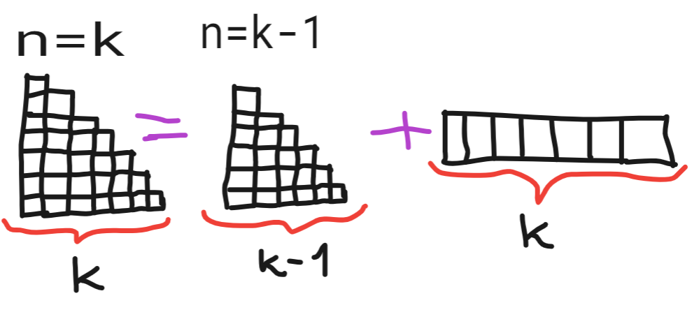

# ♻️ What's recursion? 

#### Recursion is a technique in computer programming where a function calls itself in order to solve a problem. It works by breaking a problem down into smaller and simpler sub-problems, and then solving each of those sub-problems recursively until a base case is reached. The solutions to the sub-problems are then combined to solve the original problem.        

# ➕ Pros &  ➖ Cons
### ➕ Pros
- Simplifies complex problems: Recursion can make code more readable and easier to understand by breaking down complex problems into smaller and simpler sub-problems.
- Reusable code: Recursive functions can be easily reused for similar problems, making the code more efficient.
- Elegant solution: Recursion provides a clean and elegant solution for problems that would otherwise require complex and difficult-to-follow control structures.

### ➖ Cons 
- Errors: If a recursive function is not properly designed to have an exit condition, it can lead to an infinite loop and cause a stack overflow error.
- Slower performance: Recursive functions can be slower than their iterative counterparts due to the overhead of function calls.
- Higher memory usage: Recursive functions can consume more memory compared to iterative solutions because each function call requires the creation of a new stack frame.        

# 👣 Main Steps to solve a recursive problem
### 1. What's the simplest possible input? Find the <ins>base case</base>.
### 2. Play around with simple examples and understand the pattern.
### 3. Relate hard cases to simpler cases. Verify that your pattern is correct.
### 4. Generalize the pattern. Make a <ins>formula</base>.
### 5. Write code by <ins>combining</base> the base case with the formula.         

# 📙 Examples
### <ins>Problem 1: Write a recursive function that given an input "n" sums all nonegative integers up to "n". Sum(5) = 5 + 4 + 3 + 2 + 1 = 10 </ins>      

### :one:  **Step 1: What's the simplest possible output?**  
### Define the base case of the problem.
        

### :two: Step 2: Play around with examples and visualize your thoughts.  
### Try to draw the first 3-4 cases and ...
  
 
 ### ...try to find if there is a pattern. Sum(4) is equal to sum(3) + 4. 
         

### :three: Step 3: Relate harder cases to simpler cases.  
### Solve a harder case with the your current pattern and check if it works! We can check if sum(5) = sum(4) + 5.
        

 
### :four: Step 4: Generalize the pattern.  
#### Write down the formula. The final result is: sum(n) = sum(n-1) + n

        

### :five: Step 5: Write code by combining recursive pattern with the base case.  
### Combine everything into a function.
        

 
 
 
